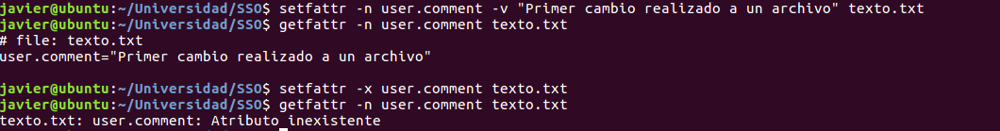
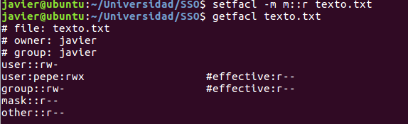

##Práctica 1 de la asignatura Seguridad de Sistemas Operativos

####Ejercicio 1(atributos extendidos de un archivo)

El comando **chattr** tiene el formato siguiente

.. chattr \[-R\] \[modo\] archivos  

En el caso de los atributos extendidos resulta interesante el poder otorgar derechos como:
.. A | con esta opción no se guardarán el momento de acceso al archivo
.. i | no se puede modificar ni borrar(salvo root)
.. u | al borrar se puede recuperar el archivo
.. s | borrado seguro haciendo que el archivo binario sea todo ceros
.. j | se guardan el diario(journal) de todo lo que le suceda al archivo

####Ejercicio 2(acl extendido)

Se muestra como un archivo al que no tiene permiso de escritura se le puede asignar a un usuario únicamente:

El comando **setfacl** tiene los siguientes parámetros:

.. -m | modifica el ACL del archivo desde línea de órdenes
.. -x | elimina el ACL

.. -M y -X son igual solo que la entrada es desde fichero

y las opciones:

.. -b | elimina el ACL por defecto 
.. -k | elimina el ACL por defecto
.. -n | no recalcula la máscara efectiva
.. -d | las operaciones son sobre Default ACL
.. -R | para que se haga recursivamente
.. -  | indica que la entrada será por entrada estándar

formato:

.. \[d\[default\]\]:\[u\[ser\]\]:]uid \[:perms\] 

está compuesto de cuatro campos, donde el primero es si queremos que se haga sobre el Default ACL, el segundo es a cual de los grupos o máscara afecta, y por último estaría los permisos que son en octal o con (r,w,x). 

Hacer notar que en cuando se crea un archivo se copia el ACL del directorio en caso de tener *default ACL* y si no se toman los parámetros de mode y mask usado cuando se crea el archivo. 

El campo **mask** sirve para indicar el máximo de credenciales que pueden tener los usuarios que no sean el propietario y cualquier grupo, propietario o no. 

El **default ACL** se usa cuando queremos que los archivos y directorios nuevos que se creen en un directorio tengan una ACL determinada.

